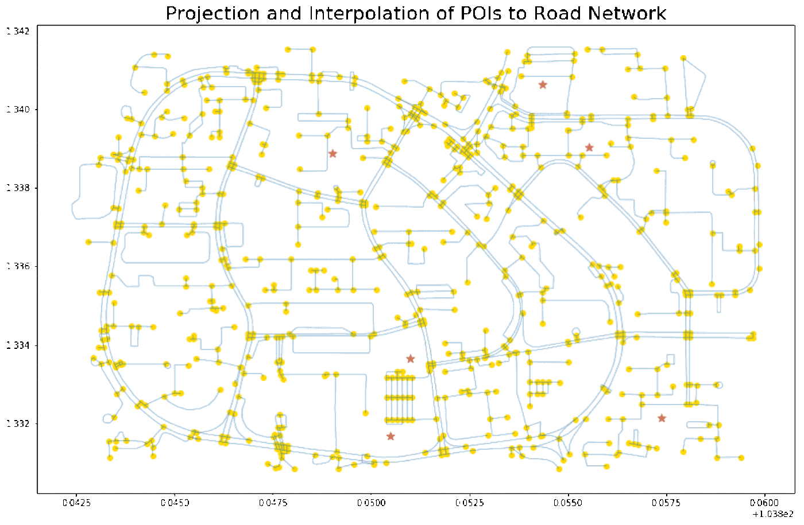
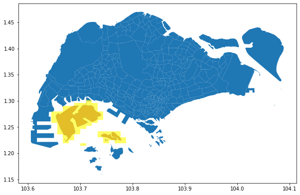
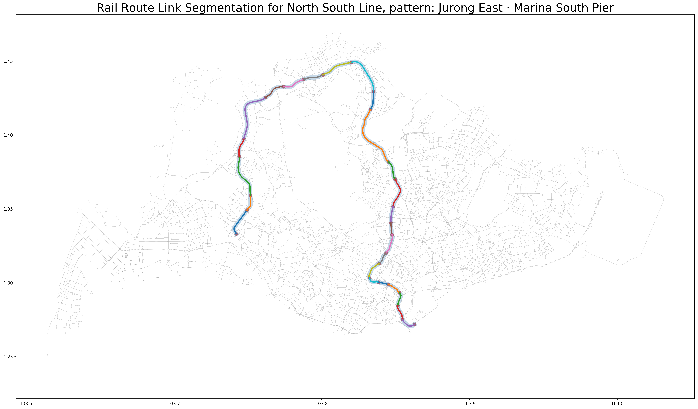

## Installation

The module is not packaged, simply copy the scripts/functions you need to your working directory/notebook and import it locally.

Do check the `requirements.txt` (non-exhaustive) for the applicable versions of key packages.

## Toolbox

> A toolbox for geospatial related tasks, but only one tool exists so far. It is accompanied with this [blog post](https://towardsdatascience.com/connecting-pois-to-a-road-network-358a81447944).

- `connect_poi()`: integrate a set of POIs onto the road network based on the nearest projected point. Use case and example illustrated in `demo_connect_poi.ipynb`.

## Convert Polygon to Geohash

> Get Geohash representation (fixed precision level) of a given polygon. A simple approach without optimization.

- `demo_polygon_to_geohash.ipynb`: demo and functions shown inside the notebook.

## Segment Rail Routes

> Download Singapore's rail network from RailRouter SG and segment the LineString by stations. This gives the user the shapes and (nearly) actual lengths of each rail link between consecutive stations of a route.

- `demo_segment_rail_routes.ipynb`: see instructions inside, the segmentation result is illustrated below. Or, you may also throw [this file](asset/sg_rail_links_viz.json) into [kepler.gl](https://kepler.gl/demo) to visualize and explore the output.

